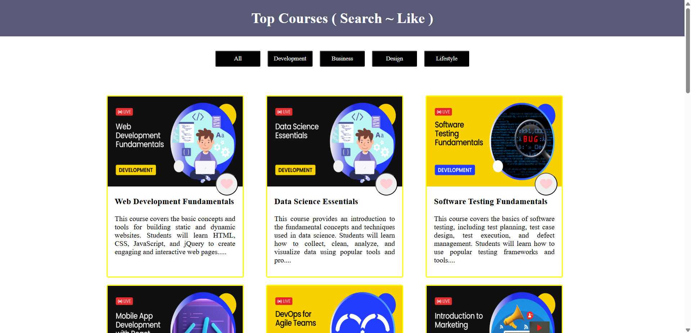
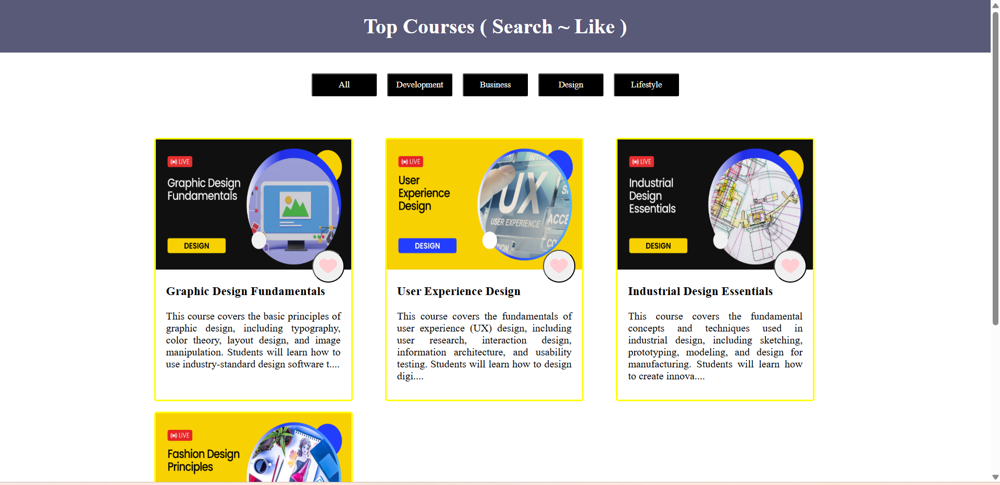
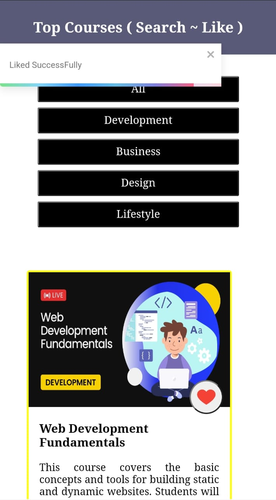
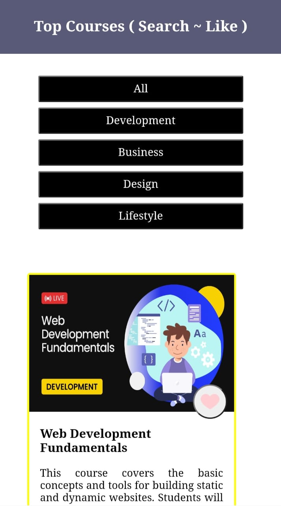

## 🎓 Course Explorer React App

*Welcome to Course Explorer! 🌟 This React app lets users browse, filter, and like courses in a beautifully responsive card layout. Perfect for exploring courses by category and keeping track of your favorites. ❤️*

**🚀 Features**
   1. Dynamic Course Cards 🃏: Each course is displayed in a card format including:
      - Course Image 🖼️
      - Category 🏷️
      - Title ✏️
      - Description 📖

   2. Category Filtering 🔍: Easily filter courses by category using the buttons:
      - All 🗂️
      - Development 💻
      - Business 💼
      - Design
      - Lifestyle 🧘

   3. Like / Unlike Courses ❤️💔
      - Click the heart icon to like a course
      - Heart turns red when liked
      - Click again to unlike
      - A toast notification pops up saying "You liked it!" or "You unliked it!" 🍿

   4. Responsive Design 📱💻: Works seamlessly on mobile, tablet, and desktop screens

**🛠️ Installation**
   1. Clone the repo: git clone https://github.com/Sourabh108-Coder/Reactfolio.git

   2. Navigate to the project folder:cd topcourse

   3. Install dependencies:npm install

   4. Start the development server: npm start

**⚙️ How It Works**
   1. The app fetches course data from an API. 🌐

   2. Courses are displayed in cards. 🃏

   3. Filter buttons update the displayed courses by category. 🔄

   4. Users can like/unlike courses by clicking the heart icon ❤️.

   5. Toast notifications show feedback when liking/unliking courses. 🥳

**📦 Project Structure**
topcourse/
│
├── public/
│   └── index.html
│
├── src/
│   ├── components/
│   │   ├── Navbar.js
│   │   ├── Card.js
│   │   └── Cards.js
|   |   └── Filter.js
|   |   └── Loader.js
│   │
│   ├── App.js
│   ├── index.js
│   └── index.css
│
├── package.json
└── README.md

**🖌️ Technologies Used**
   1. React ⚛️

   2. React Hooks (useState, useEffect) 🪝

   3. CSS3 & Flex/Grid for responsive layouts 🎨

   4. React Toastify for notifications 🍰

   5. Axios or Fetch API for data fetching 🌐

**📸 Screenshots**

## Screen 1

## Screen 2

## Screen 3

## Screen 4

## Screen 5

**💌 Feedback**
*- If you enjoy this project, give it a ⭐!*
*- For any suggestions, feel free to open an issue or submit a pull request.*

**🎉 Enjoy exploring courses and have fun learning! 🌈**

**Live Link** =>  https://reactfolio-gamma.vercel.app/

**Author**
*- Sourabh (https://github.com/Sourabh108-Coder/)*

